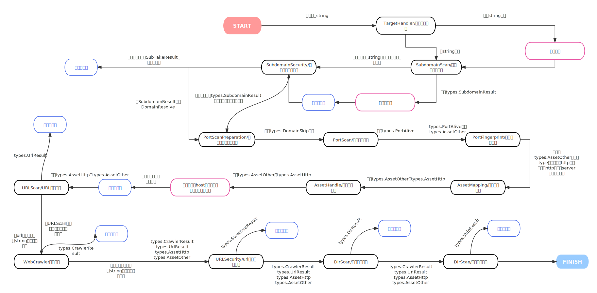
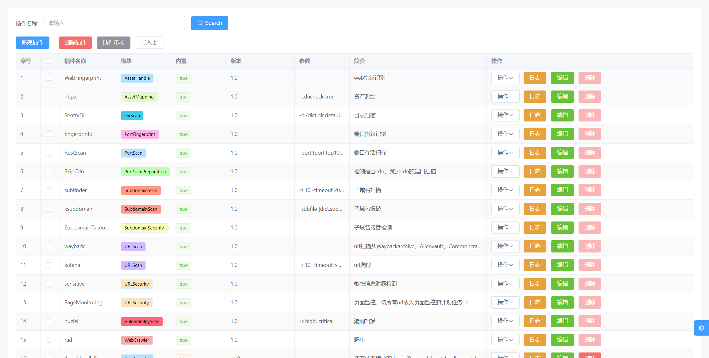
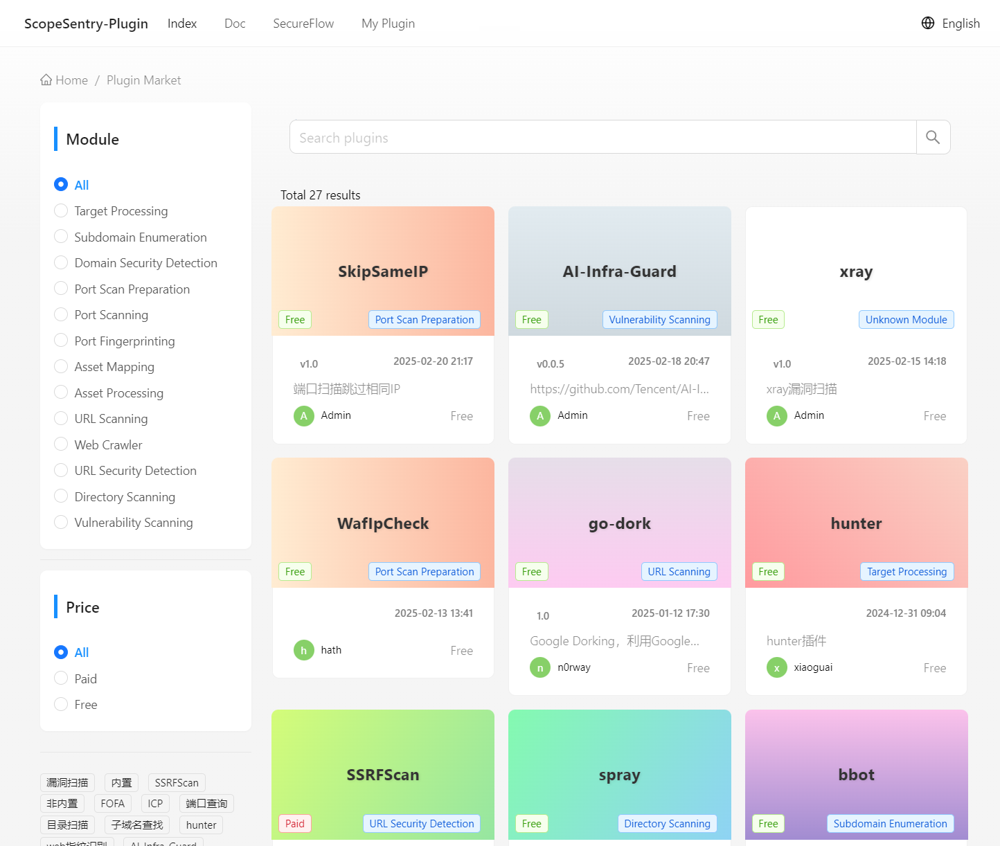
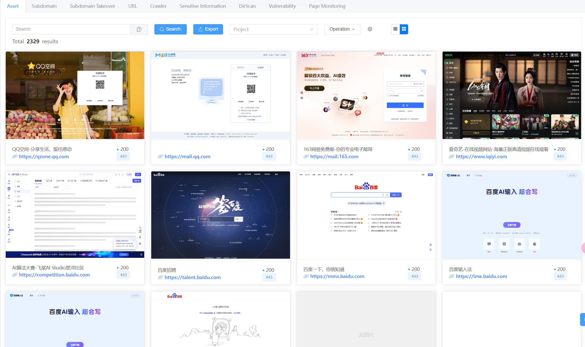
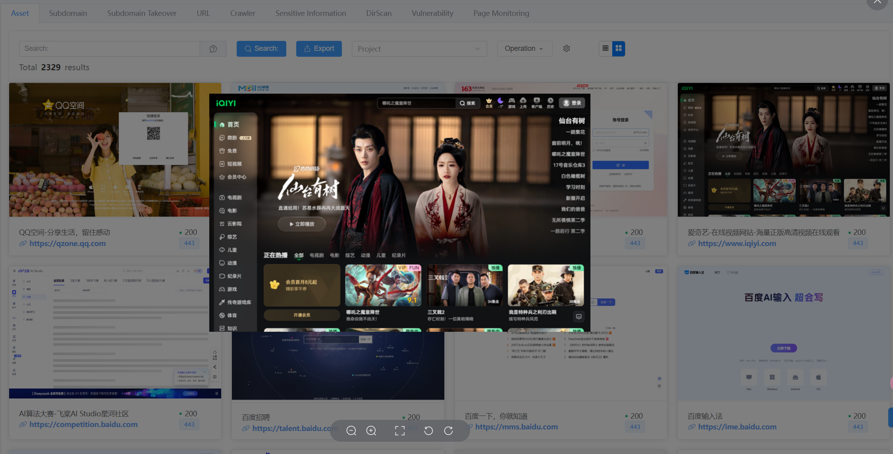
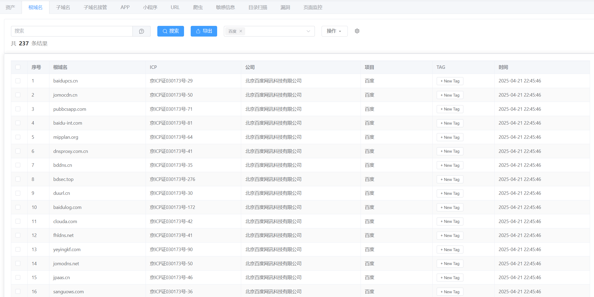
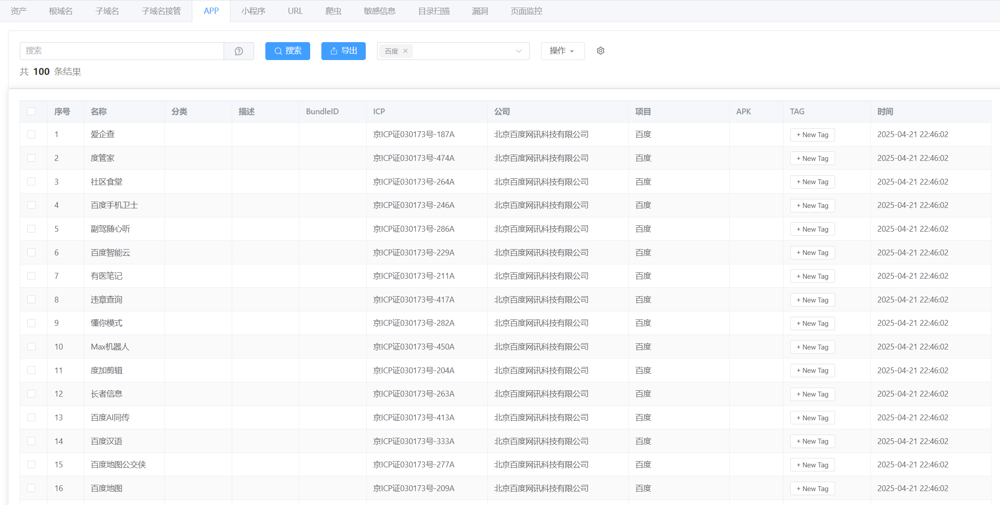
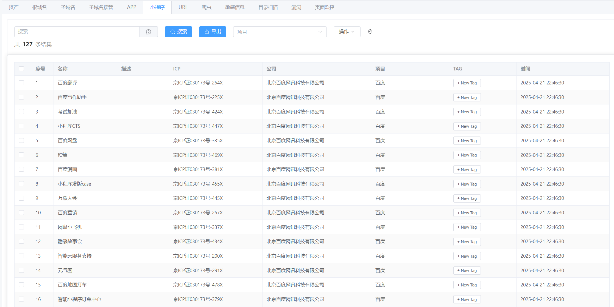
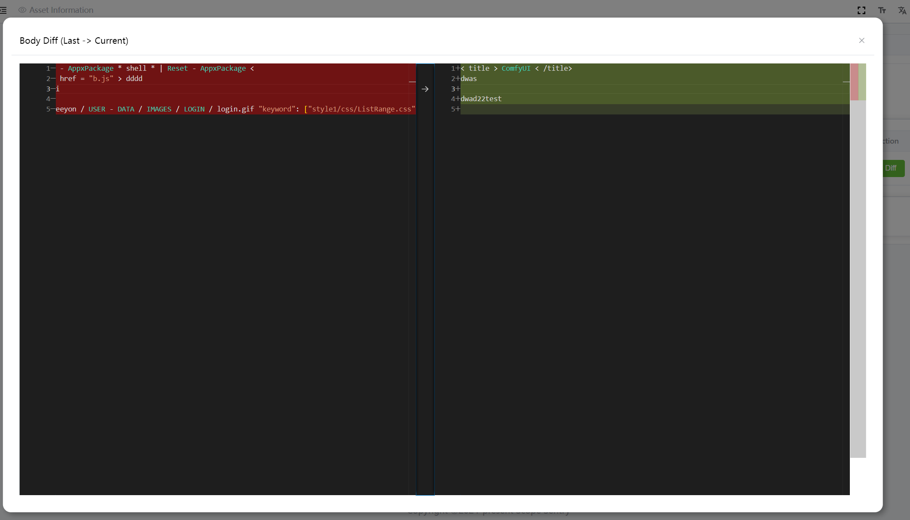
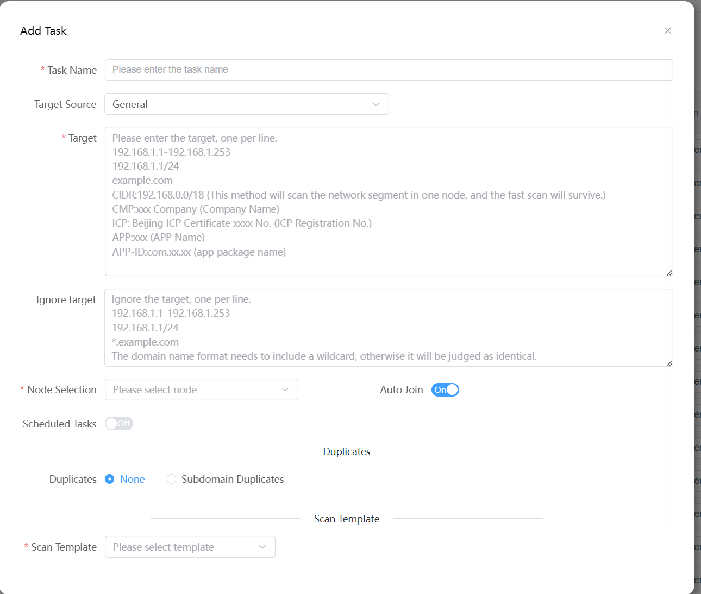

	

English | [中文](./README_CN.md)

## Introduction
Scope Sentry is a tool with functions such as asset mapping, subdomain enumeration, information leakage detection, vulnerability scanning, directory scanning, subdomain takeover, crawler, and page monitoring. By building multiple nodes, users can freely choose nodes to run scanning tasks. When new vulnerabilities emerge, it can quickly check whether the concerned assets have related components.

Distributed Implementation Reference Articles: [https://mp.weixin.qq.com/s/xfgRxUjljoQ8KzacblktxA](https://mp.weixin.qq.com/s/xfgRxUjljoQ8KzacblktxA)

Server Recommendation: [lightnode](https://www.lightnode.com/?inviteCode=CQ11JU&promoteWay=LINK)

## Discord:

[https://discord.gg/GWVwSBBm48](https://discord.gg/GWVwSBBm48)

## Language
Server：python - FastApi

Scan：go

Front-end：vue - vue-element-plus-admin

## Website

- Official Website: [https://www.scope-sentry.top](https://www.scope-sentry.top/en/)
- Github: [https://github.com/Autumn-27/ScopeSentry](https://github.com/Autumn-27/ScopeSentry)
- Scanner source code: [https://github.com/Autumn-27/ScopeSentry-Scan](https://github.com/Autumn-27/ScopeSentry-Scan)
- UI source code: [https://github.com/Autumn-27/ScopeSentry-UI](https://github.com/Autumn-27/ScopeSentry-UI)
- Plugin Market: [Plugin Market](https://plugin.scope-sentry.top/en)
- Plugin Template：[https://github.com/Autumn-27/ScopeSentry-Plugin-Template](https://github.com/Autumn-27/ScopeSentry-Plugin-Template)

## Plugin Flowchart

## Current Features
- Plugin System (Add any tool through extension)
- Subdomain Enumeration
- Subdomain Takeover Detection
- Port Scanning
- Asset Identification
- Directory Scanning
- Vulnerability Scanning
- Sensitive Information Leakage Detection
- URL Extraction
- Crawler
- Page Monitoring
- Custom WEB Fingerprint
- POC Import
- Asset Grouping
- Multi-Node Scanning
- Webhook

## To Do
- Weak Password Cracking
- 
## Installation

For installation instructions, see the [official website](https://www.scope-sentry.top)

## Communication

Discord:

[https://discord.gg/agsYdAyN](https://discord.gg/agsYdAyN)

## Screenshots

### Login

### Homepage Dashboard

## Plugin System

## Asset Data
### Assets

### Quick syntax search：

## Root Domain

### Subdomains

### Subdomain Takeover

### APP

### 小程序

### URL

### Crawler

### Sensitive Information

### Directory Scanning

### Vulnerabilities

### Page Monitoring

## Projects

## Project asset aggregation
### Panel - Overview

### Subdomains

### Port

### Service

## Tasks

## Task Progress

## Nodes

#License

All branches of this project follow AGPL-3.0, and additional terms need to be followed:
1. The commercial use of this software requires a separate commercial license.
2. Companies, organizations, and for-profit entities must obtain a commercial license before using, distributing, or modifying this software.
Individuals and non-profit organizations are free to use this software in accordance with the terms of AGPL-3.0.
4. If you have any commercial license inquiries, please contact rainy-autumn@outlook.com .
