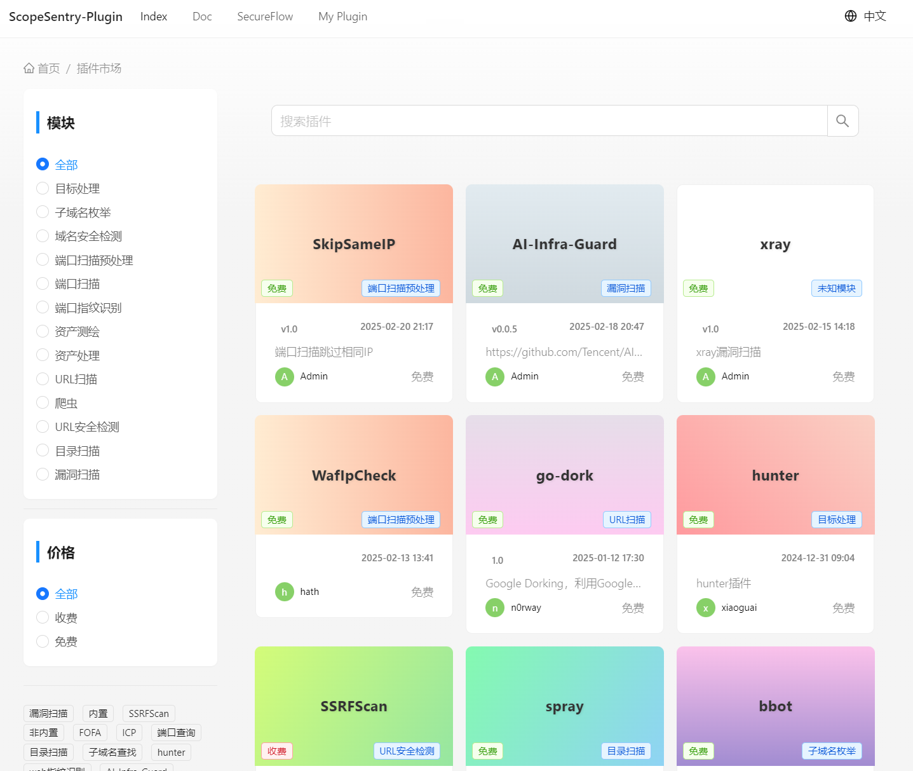
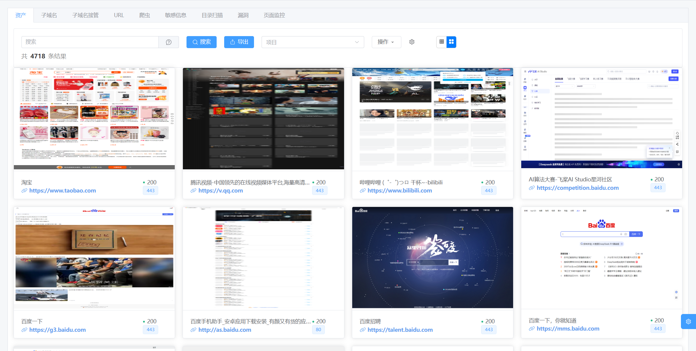
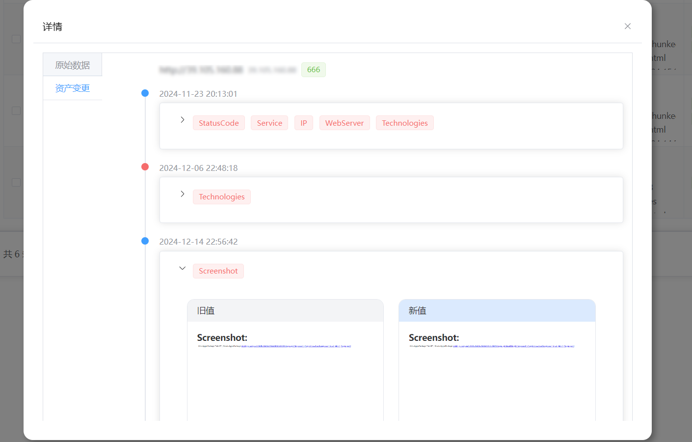
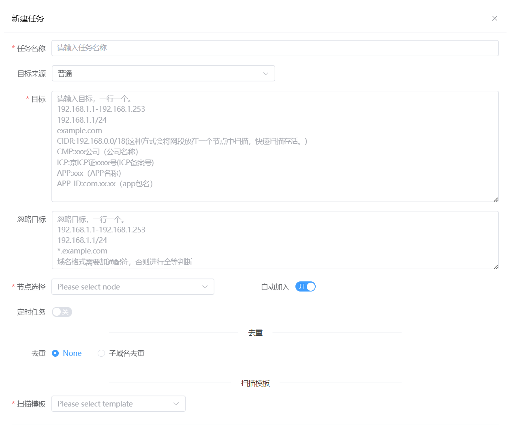
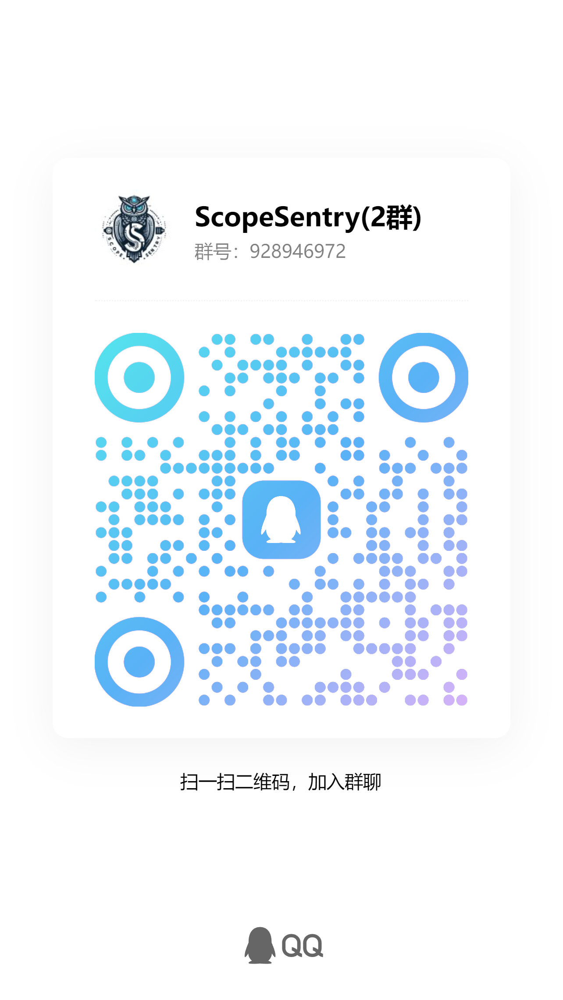

	

中文 | [English](./README.md)

## 介绍
Scope Sentry是一款具有分布式资产测绘、子域名枚举、信息泄露检测、漏洞扫描、目录扫描、子域名接管、爬虫、页面监控功能的工具，通过构建多个节点，自由选择节点运行扫描任务。当出现新漏洞时可以快速排查关注资产是否存在相关组件。

分布式搭建参考文章：[https://mp.weixin.qq.com/s/xfgRxUjljoQ8KzacblktxA](https://mp.weixin.qq.com/s/xfgRxUjljoQ8KzacblktxA)

服务器推荐：[lightnode](https://www.lightnode.com/?inviteCode=CQ11JU&promoteWay=LINK)

## 编程语言
服务端：python - FastApi

扫描端：go

前端：vue - vue-element-plus-admin

## 网址

- 官网&安装教程：[https://www.scope-sentry.top](https://www.scope-sentry.top)
- Github: [https://github.com/Autumn-27/ScopeSentry](https://github.com/Autumn-27/ScopeSentry)
- 扫描端源码：[https://github.com/Autumn-27/ScopeSentry-Scan](https://github.com/Autumn-27/ScopeSentry-Scan)
- 前端源码：[https://github.com/Autumn-27/ScopeSentry-UI](https://github.com/Autumn-27/ScopeSentry-UI)
- 插件市场: [插件市场](https://plugin.scope-sentry.top/)
- 插件模板：[https://github.com/Autumn-27/ScopeSentry-Plugin-Template](https://github.com/Autumn-27/ScopeSentry-Plugin-Template)

## 插件流程图

## 目前功能
- 插件系统（通过拓展的方式加入任何工具）
- 子域名枚举
- 子域名接管检测
- 端口扫描
- ICP自动化收集
- APP自动化收集
- 小程序自动化收集
- 资产识别
- 目录扫描
- 漏洞扫描
- 敏感信息泄露检测(支持扫描pdf)
- URL提取
- 爬虫
- 页面监控
- 自定义WEB指纹
- POC导入
- 资产分组
- 多节点扫描
- webhook
- 数据导出

## To DO
- 弱口令爆破
- 关系图

## 安装

安装教程见[官网](https://www.scope-sentry.top)

## 交流
联系方式见下方

## 赞助 && 合作
如果项目对您有帮助，赞助作者一杯咖啡吧~

## 截图

### 登录

### 首页面板

## 插件系统

## 资产数据
### 资产

### 快捷语法搜索：

## 根域名

### 子域名

### 子域名接管

### APP

### 小程序

### URL

### 爬虫

### 敏感信息

### 目录扫描

### 漏洞

### 页面监控

## 项目

## 项目资产聚合
### 面板-概况

### 子域名

### 端口

### 服务

## 任务

## 任务进度

## 节点

Discord:

[https://discord.gg/GWVwSBBm48](https://discord.gg/GWVwSBBm48)

QQ:

WX:

群满可以关注公众号后台私信拉群

# 许可证
该项目所有分支遵循AGPL-3.0，另外需要遵循附加条款：
1. 本软件的商业用途需要单独的商业许可。
2. 公司、组织和营利性实体在使用、分发或修改本软件之前必须获得商业许可。
3. 个人和非营利组织可以根据 AGPL-3.0 的条款自由使用本软件。
4. 如有商业许可查询，请联系 rainy-autumn@outlook.com。
