

	

## Website

- Official Website: [https://www.scope-sentry.top](https://www.scope-sentry.top)
- Github: [https://github.com/Autumn-27/ScopeSentry](https://github.com/Autumn-27/ScopeSentry)
- Scanner source code: [https://github.com/Autumn-27/ScopeSentry-Scan](https://github.com/Autumn-27/ScopeSentry-Scan)

## Introduction
Scope Sentry is a tool with functions such as asset mapping, subdomain enumeration, information leakage detection, vulnerability scanning, directory scanning, subdomain takeover, crawler, and page monitoring. By building multiple nodes, users can freely choose nodes to run scanning tasks. When new vulnerabilities emerge, it can quickly check whether the concerned assets have related components.

## Current Features
- Subdomain Enumeration
- Subdomain Takeover Detection
- Port Scanning
- Asset Identification
- Directory Scanning
- Vulnerability Scanning
- Sensitive Information Leakage Detection
- URL Extraction
- Crawler
- Page Monitoring
- Custom WEB Fingerprint
- POC Import
- Asset Grouping
- Multi-Node Scanning
- Webhook

## To Do
- Plugin System
- Weak Password Cracking
- Data Cleaning
- Data Sharing?
- ~
## Installation

For installation instructions, see the [official website](https://www.scope-sentry.top)

## Communication

Discord:

[https://discord.gg/agsYdAyN](https://discord.gg/agsYdAyN)

## Screenshots

### Login

### Homepage Dashboard
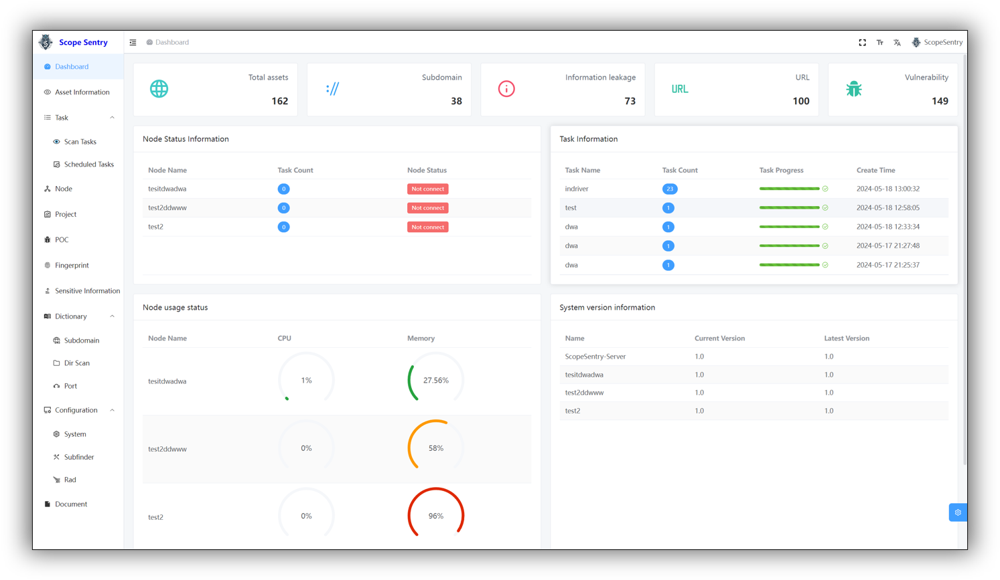

## Asset Data
### Assets
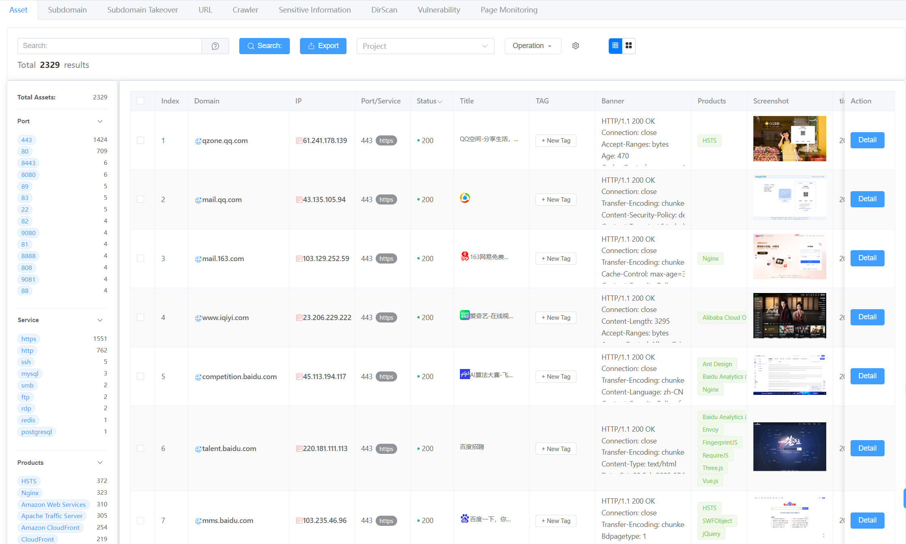

### Subdomains
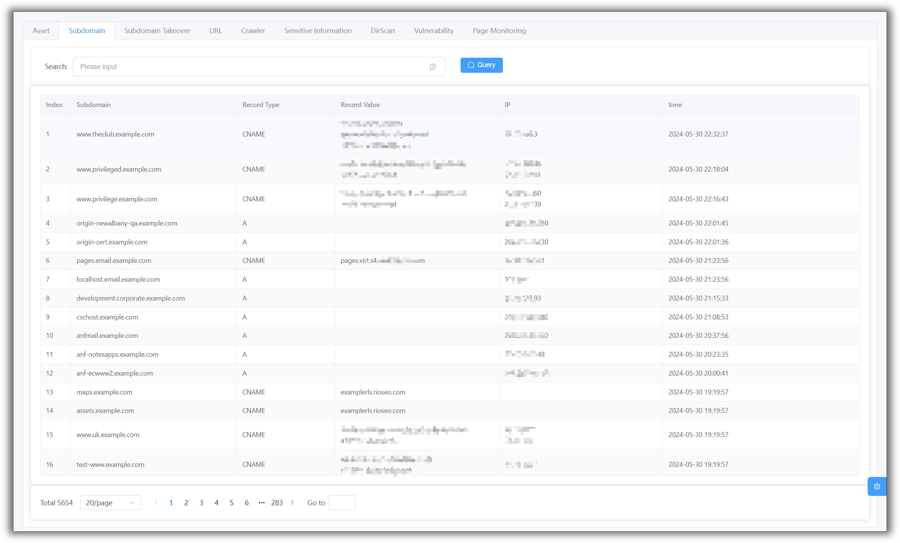

### Subdomain Takeover
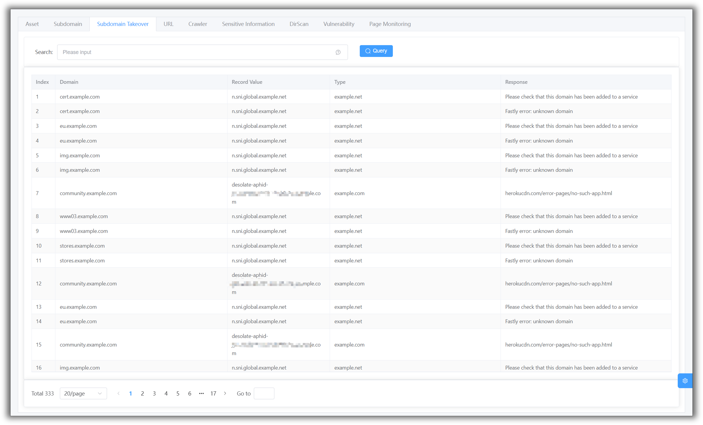

### URL
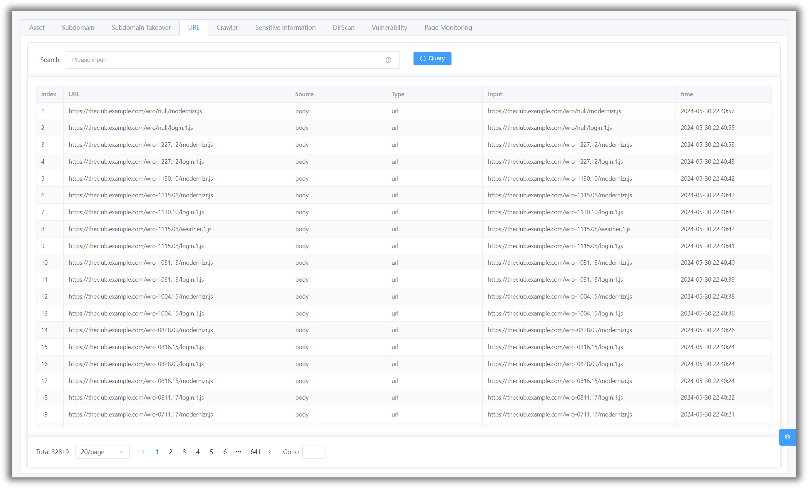

### Crawler

### Sensitive Information
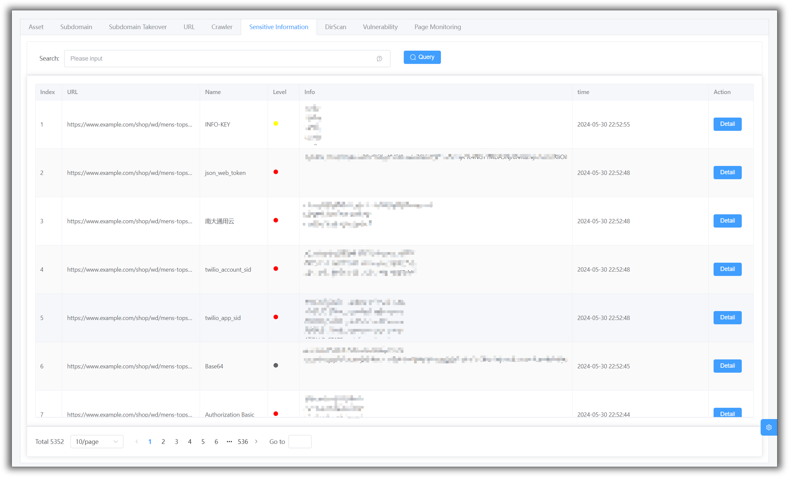

### Directory Scanning
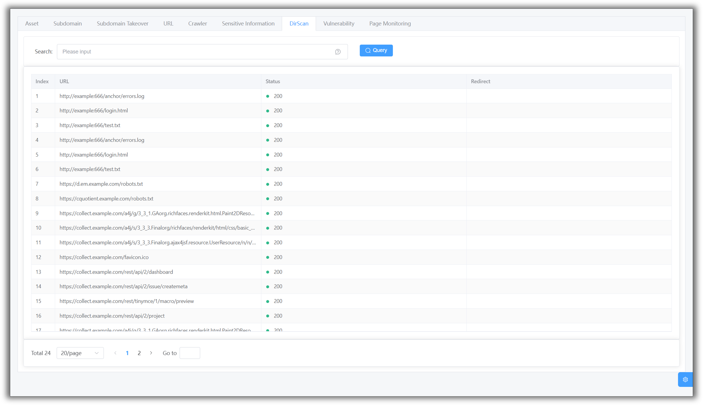

### Vulnerabilities
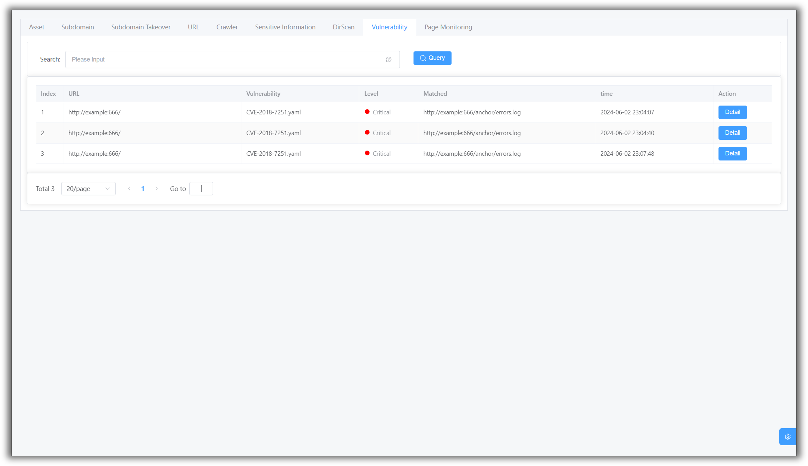

### Page Monitoring
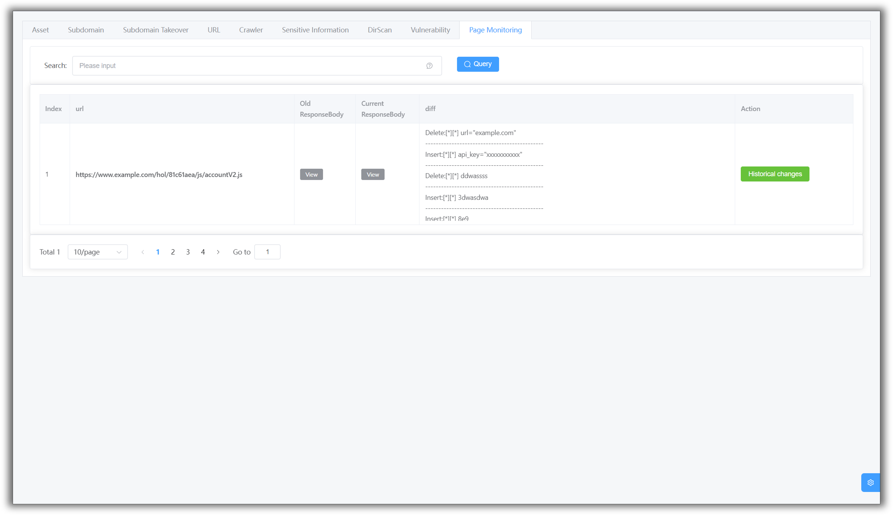

## Projects

## Tasks

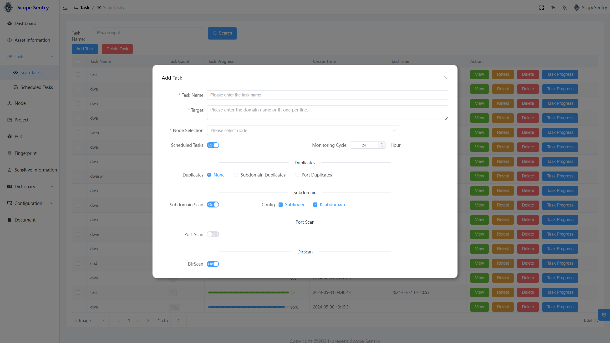

## Task Progress

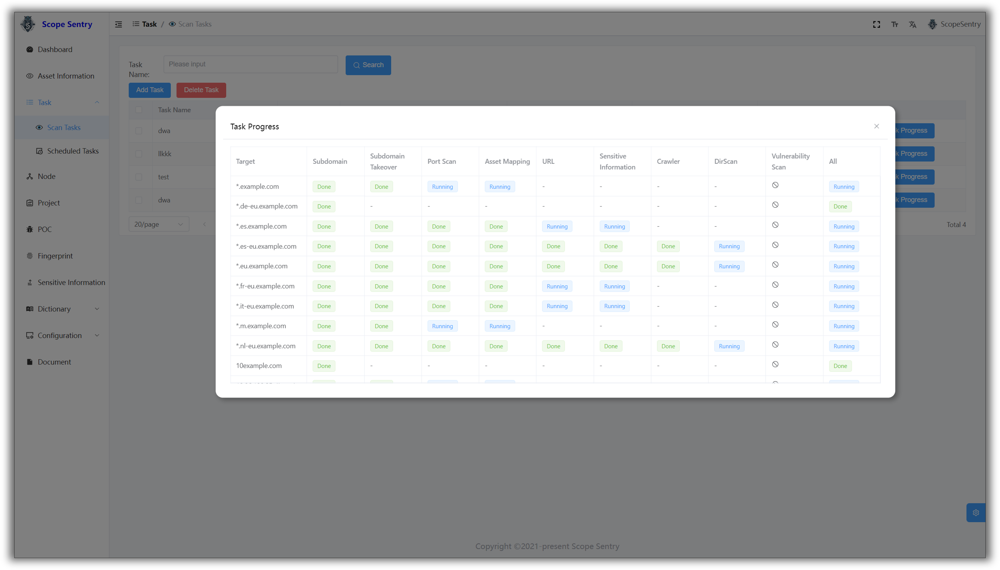

## Nodes

